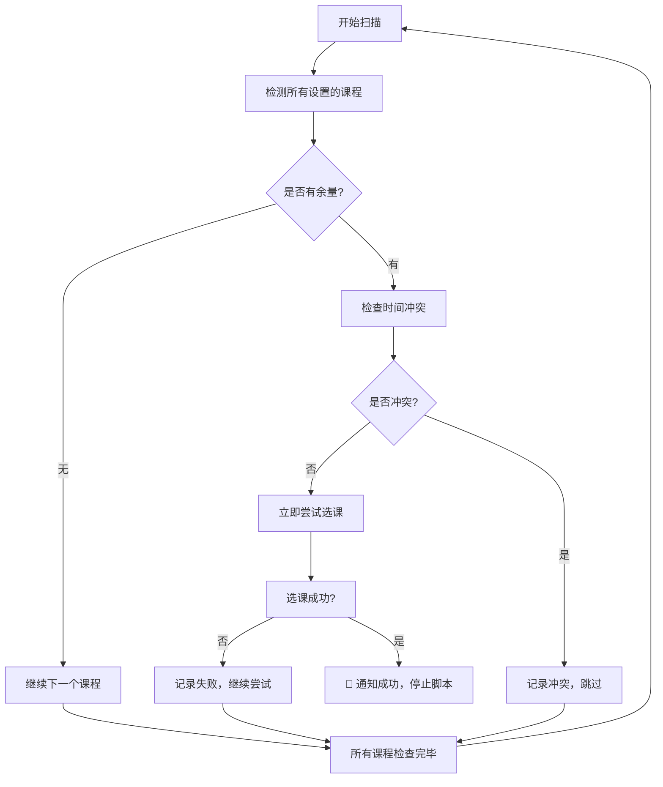

<div align="center">


# UJSCOURSE

**🎯 江苏大学智能抢课助手**

*一个功能强大、界面精美的自动抢课脚本 - 现已支持多课程同时抢课*
[](https://github.com/zhengge6/UJSCOURSE)
[](https://docs.scriptcat.org/)
[](https://docs.scriptcat.org/)
[](LICENSE)

[](https://github.com/zhengge6/UJSCOURSE/stargazers)
[](https://github.com/zhengge6/UJSCOURSE/network/members)
[](https://github.com/zhengge6/UJSCOURSE/issues)

---

**[🚀 快速开始](#-快速开始) • [� 使用文档](#-使用指南) • [🎨 界面预览](#-界面预览) • [❓ 常见问题](#-常见问题)**

</div>

## ✨ 核心特性

<div align="center">

### 🎯 多课程智能抢课系统
*支持同时监控多个课程，智能选择最优教学班*

</div>

<div align="center">
<table style="border: none;">
<tr>
<td width="25%" align="center">

### 🎨 现代设计
- 🌟 毛玻璃效果界面
- ⚡ 流畅动画过渡
- 📱 响应式布局设计
- 🌙 深色主题适配

</td>
<td width="25%" align="center">

### 🎯 智能抢课
- 🔥 **多课程同时支持**
- 🤖 自动余量检测
- 🛡️ 冲突智能避免
- 🔄 多教学班尝试
- 🚀 失败自动重试

</td>
<td width="25%" align="center">

### ⏰ 精确定时
- 📋 **可视化课程管理**
- 📅 日历可视化选择
- ⏱️ 秒级精确定时
- ⏳ 倒计时实时显示
- 🤖 自动启动执行

</td>
<td width="25%" align="center">

### 🛡️ 安全可靠
- 🔍 开源代码审查
- ✅ 无恶意代码
- 💾 本地数据存储
- 🔒 隐私安全保护

</td>
</tr>
</table>
</div>

## � v3.0.0 新功能亮点

<div align="center">

### 🎯 多课程同时抢课
现在支持同时设置多个课程号，大大提高抢课成功率！

<table>
<tr>
<td width="50%" align="center">

#### 📋 课程管理器
- 可视化添加/删除课程
- 支持无限数量课程
- 一键管理所有目标课程

</td>
<td width="50%" align="center">

#### 🎯 智能轮询
- 自动遍历所有课程
- 优先抢选有余量的课程
- 详细日志记录抢课进度

</td>
</tr>
</table>

</div>

---

## �🎨 界面预览

<div align="center">

### 📅 日历定时选择器


*精美的日历界面，支持精确到秒的定时设置*

### 🎛️ 主控制面板


*现代化毛玻璃设计，实时显示运行状态和日志*

### 🔗 教务系统集成


## 🚀 快速开始指南

<div align="center">

### ⚡ 三步开始抢课

</div>

### 第一步：安装脚本管理器

<div align="center">
<table style="border: none;">
<tr>
<td align="center" width="50%" style="padding: 20px;">

#### 🐱 脚本猫 (推荐)

[](https://docs.scriptcat.org/)

**新一代用户脚本管理器**

✅ 更快的启动速度  
✅ 更严格的安全检查  
✅ 自动检测脚本更新  
✅ 现代化界面设计  
✅ 更好的中文支持  

**下载链接：**
- [Microsoft Edge](https://microsoftedge.microsoft.com/addons/detail/%E8%84%9A%E6%9C%AC%E7%8C%AB/liilgpjgabokdklappibcjfablkpcekh)
- [Chrome 商店](https://chrome.google.com/webstore/detail/scriptcat/ndcooeababalnlpkfedmmbbbgkljhpjf)

</td>
<td align="center" width="50%">

#### 🐒 Tampermonkey (备选)

[](https://www.tampermonkey.net/)

**经典用户脚本管理器**

✅ 成熟稳定的解决方案  
✅ 广泛的浏览器支持  
✅ 丰富的社区资源  

**下载链接：**
- [官方网站](https://www.tampermonkey.net/)

</td>
</tr>
</table>

<div align="center">

### 第二步：安装抢课脚本

</div>

```bash
# 1. 复制脚本代码
# 2. 在脚本管理器中创建新脚本
# 3. 粘贴代码并保存
# 4. 访问江苏大学教务系统
```

<div align="center">

**🎉 安装完成！访问教务系统即可看到抢课助手**

</div>

## 📖 详细使用教程

<div align="center">

### 🎯 三步轻松抢课

</div>

<div align="center">
<table style="border: none;">
<tr>
<td align="center" width="33%" style="padding: 20px;">

### 1️⃣ 设置课程


#### 🆕 两种方式：

**方式一：课程管理器 (推荐)**
- 💡 点击主界面"📋 管理课程"按钮
- ➕ 在输入框输入课程号点击添加
- 🗑️ 支持一键删除不需要的课程

**方式二：右键菜单快速设置**
- �️ 右键菜单选择"�📋 课程管理器"
- 📝 或选择"⚙️ 批量设置课程号"
- ⚡ 输入多个课程号用逗号分隔

</td>
<td align="center" width="33%" style="padding: 20px;">

### 2️⃣ 配置定时


#### 📅 日历定时器：

- 🗓️ 点击"设置/修改定时"按钮
- ⏰ 使用日历选择器设置日期时间
- ⚡ 支持精确到秒的定时设置
- 🔄 倒计时实时显示

**(可选步骤 - 也可直接开始抢课)**

</td>
<td align="center" width="33%" style="padding: 20px;">

### 3️⃣ 开始抢课


#### 🤖 智能特性：

- 🔄 自动轮询所有设置的课程
- 🎯 优先选择有余量的教学班
- 🛡️ 智能避免时间冲突的课程
- 📊 实时显示抢课进度和日志
- 🎉 成功后自动通知并停止

**点击开始，享受多课程智能抢课！**

</td>
</tr>
</table>
</div>

## 📚 高级功能详解

<div align="center">

### 🔥 课程管理器完全指南

</div>

<details>
<summary><b>🎯 课程管理器详细教程</b></summary>

<br>

#### 📱 打开课程管理器的三种方式：

1. **主界面操作 (推荐)**
   ```
   🖱️ 在抢课助手主界面点击 "📋 管理课程" 按钮
   ✨ 立即打开可视化课程管理器
   ```

2. **右键菜单操作**
   ```
   🖱️ 右键网页 → 选择 "📋 课程管理器 (推荐)"
   ⚡ 快速访问课程管理功能
   ```

3. **批量设置模式**
   ```
   🖱️ 右键网页 → 选择 "⚙️ 批量设置课程号"
   📝 一次性输入多个课程号 (格式: 12345,67890,11111)
   ```

#### 🎮 操作步骤详解：

**添加课程：**
- 📝 在输入框中输入完整的课程号 (如: 12345)
- ⚡ 点击"➕ 添加"按钮或直接按回车键
- ✅ 课程将立即出现在下方列表中

**删除课程：**
- 👀 在课程列表中找到要删除的课程
- 🗑️ 点击对应的"🗑️ 删除"按钮
- ⚠️ 确认删除后该课程将从抢课目标中移除

**实时预览：**
- 📊 主界面会实时显示已设置的课程数量
- 🔄 所有更改立即生效，无需重启脚本

</details>

<details>
<summary><b>🤖 智能抢课算法工作原理</b></summary>

<br>

#### 🧠 AI智能决策流程：



#### ⚡ 算法优势：

**🎯 智能优先级：**
- 优先选择有剩余名额的教学班
- 自动避免已知时间冲突的教学班  
- 智能跳过已尝试过的教学班

**🔄 高效轮询：**
- 2秒间隔检查，确保及时发现机会
- 最多尝试1000次，避免无限循环
- 最多允许5次失败后自动停止

**📊 透明监控：**
- 详细日志记录每次操作
- 实时显示当前处理的课程
- 成功率统计和进度追踪

</details>

## ❓ 常见问题

<details>
<summary><b>🎯 如何设置多个课程号？</b></summary>

<br>

**两种方式：**

✅ **方式一：课程管理器（推荐）**
- 点击主界面"📋 管理课程"按钮
- 逐个添加需要的课程号
- 支持实时查看和删除

✅ **方式二：菜单批量设置**
- 右键菜单选择"⚙️ 设置课程号"
- 输入格式：12345,67890,11111（用逗号分隔）

</details>

<details>
<summary><b>📊 多课程模式下的优先级如何？</b></summary>

<br>

**智能优先级规则：**

✅ 优先选择有剩余名额的教学班  
✅ 避免已知时间冲突的教学班  
✅ 按扫描顺序进行尝试  
✅ 成功抢到任意一门课程后自动停止  

**注意：** 脚本会智能选择最有可能成功的课程，无需手动设置优先级

</details>

<details>
<summary><b>🔧 脚本无法启动怎么办？</b></summary>

<br>

**请检查以下几点：**

✅ 确认已正确安装脚本管理器扩展  
✅ 确认脚本已启用（绿色指示灯）  
✅ 确认当前网址匹配脚本运行条件  
✅ 刷新页面重试  

</details>

<details>
<summary><b>⚙️ 设置了课程号但显示"未设置"？</b></summary>

<br>

**请检查：**

✅ 课程号格式是否正确（纯数字）  
✅ 是否保存了设置  
✅ 尝试重新设置课程号  

</details>

<details>
<summary><b>⏰ 定时功能不工作？</b></summary>

<br>

**请确认：**

✅ 设置的时间是否为未来时间  
✅ 浏览器页面是否一直打开  
✅ 电脑是否处于唤醒状态  

</details>

<details>
<summary><b>🚀 如何优化成功率？</b></summary>

<br>

**建议：**

✅ 设置3-5个备选课程提高成功率  
✅ 在选课开放前几分钟启动脚本  
✅ 保持网络连接稳定  
✅ 关闭其他占用带宽的应用  
✅ 选择不同时间段的课程减少冲突  

</details>

## ⚠️ 免责声明

<div align="center">

⚠️ **重要提醒**

本项目仅供**学习交流**使用，请遵守学校相关规定

**v3.0.0 新版本说明：**
- 🎯 支持多课程同时抢课，大幅提升成功率
- 📋 新增可视化课程管理器，操作更便捷
- ⚡ 智能抢课算法，自动优化选择策略

**使用本工具产生的任何后果由用户自行承担**

</div>

---

<div align="center">

## 🤝 贡献与支持

**🆕 v3.0.0 - 多课程支持版本**

**如果这个项目对您有帮助，请考虑给我们一个 ⭐**

[](https://github.com/zhengge6/UJSCOURSE/stargazers)
[](https://github.com/zhengge6/UJSCOURSE/network/members)

### 🎯 版本更新历程

- **v3.0.0** - 🎯 多课程同时支持，课程管理器，智能抢课算法
- **v2.9.0** - 🎨 现代化UI设计，日历定时选择器
- **v2.8.0** - ⚡ 性能优化，错误处理增强

### 📞 联系方式

[](https://github.com/zhengge6/UJSCOURSE/issues)
[](https://github.com/zhengge6/UJSCOURSE/discussions)

---

### 📄 开源协议

[](https://opensource.org/licenses/MIT)

**Copyright © 2025 [zhengge6](https://github.com/zhengge6)**

---


**Made with ❤️ for UJS Students**

</div>
