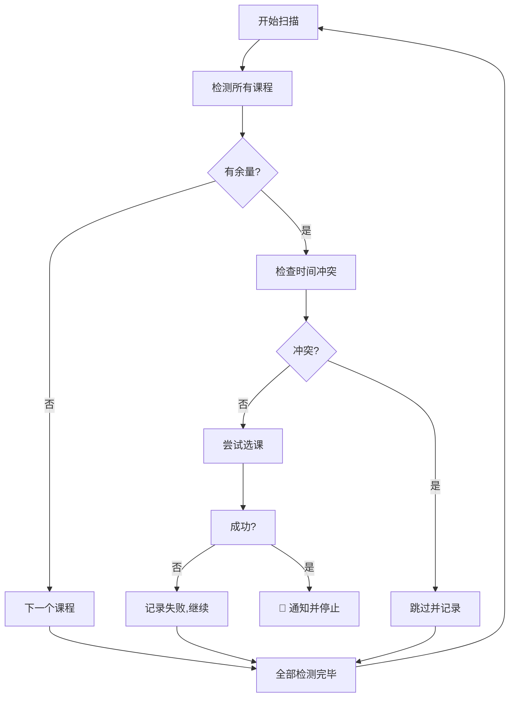

# UJSCOURSE

**🎯 江苏大学智能抢课助手**

自动化 · 智能 · 多课程支持 · 现代化视觉体验

  
  
  
  

  
  
  

---

**[🚀 快速开始](#快速开始指南) • [📖 使用文档](#详细使用教程) • [❓ 常见问题](#常见问题)**

---

## ✨ 核心特性

<table>
<tr>
<td width="25%" valign="top">

#### 🎨 现代化设计
- 毛玻璃高斯模糊
- 流畅动画与过渡
- 响应式布局
- 深色模式自动适配

</td>
<td width="25%" valign="top">

#### 🧠 智能抢课
- 多课程同步支持
- 自动余量检测
- 冲突智能规避
- 多教学班自动尝试
- 失败后自动重试

</td>
<td width="25%" valign="top">

#### ⏰ 精确定时
- 可视化课程管理
- 日历选择定时
- 秒级定时设置
- 倒计时实时显示
- 自动启动

</td>
<td width="25%" valign="top">

#### 🛡️ 安全可靠
- 开源透明
- 无恶意代码
- 本地数据存储
- 隐私安全保护

</td>
</tr>
</table>

---

## 🌟 v3.0.0 新功能亮点

<table>
<tr>
<td width="50%">

#### 📋 课程管理器
- 课程添加/删除一目了然
- 无限数量课程支持
- 一键管理所有目标课程

</td>
<td width="50%">

#### 🔄 智能轮询
- 自动遍历所有目标课程
- 优先抢选余量充足的班级
- 日志详细记录抢课进度

</td>
</tr>
</table>

---

<!-- 预览图片模块已移除 -->

## 🚀 快速开始指南

### ⚡ 三步开启智能抢课体验

<ol>
<li>
<b>安装脚本管理器</b>
<table>
<tr>
<td width="50%" align="center" valign="top">

🐱 <b>脚本猫（推荐）</b> 

<ul>
<li>极速启动</li>
<li>安全合规</li>
<li>自动检测更新</li>
<li>现代UI</li>
<li>强力中文支持</li>
</ul>
下载：
<a href="https://microsoftedge.microsoft.com/addons/detail/%E8%84%9A%E6%9C%AC%E7%8C%AB/liilgpjgabokdklappibcjfablkpcekh">Edge</a> ·
<a href="https://chrome.google.com/webstore/detail/scriptcat/ndcooeababalnlpkfedmmbbbgkljhpjf">Chrome</a>

</td>
<td width="50%" align="center" valign="top">

🐒 <b>Tampermonkey（备选）</b> 

<ul>
<li>成熟稳定</li>
<li>全平台支持</li>
<li>庞大社区</li>
</ul>
<a href="https://www.tampermonkey.net/">官方网站</a>

</td>
</tr>
</table>
</li>
<li>
<b>安装抢课脚本</b>
<pre style="background:#f8f8f8;border-radius:8px;padding:8px;">
1. 复制脚本代码
2. 在脚本管理器中新建脚本
3. 粘贴保存
4. 访问江苏大学教务系统
</pre>
</li>
<li>
<b>享受抢课助手</b>

🎉 安装完成，访问教务系统即可体验智能抢课

</li>
</ol>

---

## 📖 详细使用教程

### 🪄 三步轻松抢课

<table>
<tr>
<td width="33%" valign="top">

#### 1️⃣ 设置课程
- 通过主界面“📋 管理课程”按钮添加
- 支持一键删除
- 右键菜单批量设置，逗号分隔课程号

</td>
<td width="33%" valign="top">

#### 2️⃣ 配置定时
- “设置/修改定时”按钮
- 日历选择器支持到秒
- 倒计时实时显示
- 可随时修改或取消

</td>
<td width="33%" valign="top">

#### 3️⃣ 开始抢课
- 自动轮询所有目标课程
- 优先抢余量课程，智能避免冲突
- 实时日志与抢课进度
- 成功即自动通知与停止

</td>
</tr>
</table>

---

## 📚 高级功能详解

<b>📋 课程管理器完全指南</b>

- 主界面点击“📋 管理课程”
- 右键网页选择“📋 课程管理器”
- 批量设置模式，一次输入多个课程号

<b>添加/删除课程</b>：
- 输入完整课程号，点击添加或回车
- 课程即刻出现在列表
- 删除按钮一键移除

<b>实时预览：</b>
- 主界面显示课程数量
- 所有更改即时生效

<b>🤖 智能抢课算法原理</b>

<b>算法优势：</b>
- 优先剩余名额班级
- 自动规避冲突
- 2秒轮询，最多尝试1000次，失败自动停止
- 详细日志与进度统计

---

## ❓ 常见问题

<b>如何设置多个课程号？</b>

主界面逐个添加或右键菜单批量输入（逗号分隔）。

<b>多课程模式优先级如何？</b>

优先抢余量充足的班级，自动规避冲突，抢到即自动停止。

<b>脚本无法启动？</b>

检查脚本管理器安装、脚本启用、网址匹配、刷新页面。

<b>课程号显示未设置？</b>

确认数字格式、已保存设置、重新设置。

<b>定时功能不工作？</b>

确认设置为未来时间，页面常开，电脑唤醒。

<b>如何优化成功率？</b>

设置3-5门备选课程，提前几分钟启动，保持网络畅通。

---

## ⚠️ 免责声明

本项目仅供学习交流，请遵守校规 
新版本支持多课程抢课、可视化管理器、智能算法 
使用工具造成的后果由用户自负

---

## 🤝 贡献与支持

**🆕 v3.0.0 - 多课程支持版本**

如果这个项目对你有帮助，请点个 ⭐️

  
  

<b>版本历程</b>
- <b>v3.0.0</b> 多课程支持、课程管理器、智能选课算法
- <b>v2.9.0</b> 现代UI、日历定时器
- <b>v2.8.0</b> 性能优化、错误增强

<b>交流反馈</b>：

---

### 📄 开源协议

Copyright © 2025 <a href="https://github.com/zhengge6">zhengge6</a>

---

**Made with ❤️ for UJS Students**

